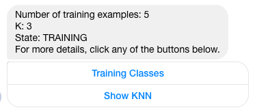
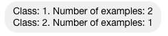
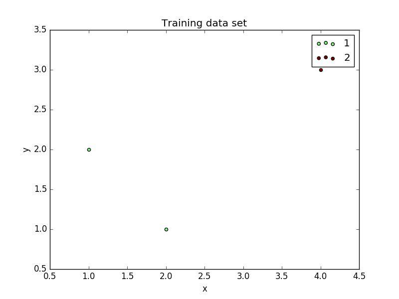
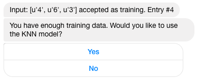

# Knnbot: a KNN Messenger Bot

Knnbot is a Facebook Messenger bot written in Python, capable of training a machine learning algorithm known as [K-Nearest Neighbor](https://en.wikipedia.org/wiki/K-nearest_neighbors_algorithm) using manually inputted data from a user. This project is more on the experimental side, a simple proof of concept where I wanted to show a use case of how a machine learning algorithm could be applied to a chatbot.

## Dependencies
- Flask==0.11.1
- requests==2.10.0
- numpy==1.11.1
- pymessenger==0.0.7.0 ([PyMessenger](https://github.com/davidchua/pymessenger))
- pillow==3.1.1
- matplotlib==1.5.3

With `pip` run `pip install -r requirements.txt`

## Regarding the algorithm
For simplicity purposes the bot just accepts feature vectors of **two** dimensions whose features are **integers**. This could be easily changed by just modifying the input validation in the function `add_to_training`

The algorithm itself has no limitations regarding this.

## Features
The bot accepts the command `status` which will print the number of training examples the user has inputted, the K, and the state in which the bot is currently at, which is either **training** if the user is training the system, or **predict** is the user has enough training examples.

Also, there will be two buttons: training classes, and show knn. The first one will show all the different classes seen during training and the number of cases associated with that label. The second button will display a 2D scatterplot of the training examples which each data point colored depending on its class.

Status button

Different classes and their frequencies

Plot of how the KNN model looks

## Instructions
At start, Knnbot will in the **training** state. During this state the user have to input a feature vector made of two integers, and the class or label, which should
also be an integer. For example `10,5,2` is a feature vector `[10,5]` with class `2`.

Once the user has **3** or more training examples, Knnbot will ask you if you which to test the system. If the answer is yes,
then Knnbot will be in **predict** state. While in this state, Knnbot will predict the class of your input which should be of the form
`x,y` where `x` and `y` are **integers**; this input is the feature vector.

To switch back to the **training** or **predict** state, type the command `train` or `predict`.

To recap, these are all the commands.
During **TRAINING** state:
-  To create a new training example, create a new feature vector of the shape `x,y,z` where `x` and `y` are the features, and `z` is the class.
During **TEST** state:
- To test the system, write a feature vector of the shape `x,z` where `x` and `y` are the features.

During any state:
- `status` to see several information regarding the training
- `train` to enter the training state
- `test` to enter the testing state (if the bot has more than K training examples).

